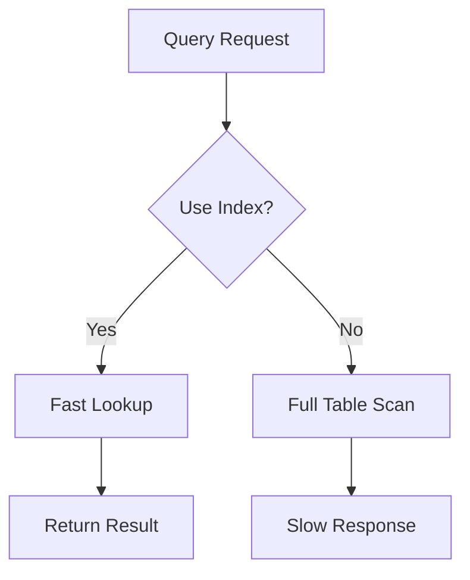

# Pluto Dating App - Performance & Storage Optimization Plan

## Executive Summary

This document outlines comprehensive optimizations to make the Pluto dating app faster and reduce database storage through data compression techniques.

---

## 1. Current Architecture Analysis

### 1.1 Data Storage Components

| Component | Current State | Storage Type |
|-----------|---------------|--------------|
| **User Photos** | JPEG @ 85% quality, max 1200px | GCS/Local |
| **Database** | PostgreSQL (AlloyDB) | Cloud SQL |
| **Cache** | SharedPreferences (Flutter) | Local |
| **Messages** | Plain TEXT storage | PostgreSQL |
| **API Responses** | No compression | Network |

### 1.2 Identified Compression Opportunities

- **Images**: WebP conversion, better thumbnail generation
- **Database**: Enable PostgreSQL compression, optimize TEXT fields
- **API Responses**: Enable gzip compression
- **Flutter Cache**: Add compression for local data
- **Chat Messages**: Compress message content

---

## 2. Data Compression Implementation Plan

### 2.1 Image Compression & Optimization


**Actions:**
- [ ] Convert image uploads to WebP format (30-50% smaller than JPEG)
- [ ] Implement progressive JPEG fallback for older clients
- [ ] Generate optimized thumbnails at 300px, 600px, 900px sizes
- [ ] Use GCS object lifecycle policies to auto-delete old uploads

**Code Changes Required:**
```python
# In user_service.py - upload_photo method
# 1. Convert to WebP instead of JPEG
# 2. Generate multiple thumbnail sizes
# 3. Store compressed data
```

### 2.2 Database Compression

**Actions:**
- [ ] Enable PostgreSQL `pg_toast` compression for large TEXT fields
- [ ] Apply `TOAST` compression to: bio, description, messages.content
- [ ] Add `pg_stat_statements` extension for query monitoring
- [ ] Implement data archiving for old messages/chats

**SQL Changes:**
```sql
-- Add compression to text columns
ALTER TABLE profiles ALTER COLUMN bio SET STORAGE EXTENDED;
ALTER TABLE messages ALTER COLUMN content SET STORAGE EXTENDED;
ALTER TABLE trips ALTER COLUMN description SET STORAGE EXTENDED;
```

### 2.3 API Response Compression

**Actions:**
- [ ] Enable gzip compression on FastAPI responses
- [ ] Compress JSON responses automatically
- [ ] Implement compression middleware

**Code Changes:**
```python
# In main.py - add compression middleware
from fastapi.middleware.compress import CompressMiddleware
app.add_middleware(CompressMiddleware, minimum_size=1000)
```

### 2.4 Local Storage Compression (Flutter)

**Actions:**
- [ ] Compress SharedPreferences data using gzip
- [ ] Implement encrypted cache for sensitive data
- [ ] Add LZ4 compression for local JSON cache

---

## 3. Performance Optimization Plan

### 3.1 Database Query Optimization



**Actions:**
- [ ] Add composite indexes for common query patterns
- [ ] Implement `selectinload` for all relationships (already partially done)
- [ ] Add pagination to all list endpoints
- [ ] Implement query result caching with Redis

**Index Additions:**
```sql
-- For swipes discovery
CREATE INDEX idx_swipes_discovery ON swipes(swiped_id, mode, action) 
WHERE action = 'LIKE';

-- For messages
CREATE INDEX idx_messages_recent ON messages(chat_id, created_at DESC) 
WHERE is_deleted = FALSE;
```

### 3.2 Local App Caching

**Actions:**
- [ ] Use Flutter SharedPreferences for local caching
- [ ] Implement in-memory cache in FastAPI (lru_cache)
- [ ] Cache user profiles locally in Flutter app
- [ ] Add cache invalidation on updates

**Cache Architecture:**
```
┌─────────────┐     ┌─────────────┐     ┌─────────────┐
│   Flutter   │────▶│    Redis    │────▶│  PostgreSQL │
│    App      │     │   Cache     │     │   Database  │
└─────────────┘     └─────────────┘     └─────────────┘
```

### 3.3 Connection Pool Optimization

**Current Settings:**
```python
DATABASE_POOL_SIZE: int = 20
DATABASE_MAX_OVERFLOW: int = 10
```

**Actions:**
- [ ] Increase pool size for production (50-100)
- [ ] Add connection pooler (PgBouncer)
- [ ] Implement prepared statement caching

### 3.4 Async Processing

**Actions:**
- [ ] Make photo processing async (background task)
- [ ] Implement message delivery via WebSocket
- [ ] Add task queue for notifications

---

## 4. Implementation Roadmap

### Phase 1: Quick Wins (Week 1)

- [ ] Enable gzip compression on FastAPI
- [ ] Add database indexes for common queries
- [ ] Optimize image upload pipeline (WebP)
- [ ] Add TOAST compression to TEXT columns

### Phase 2: Local App Caching (Week 2)

- [ ] Use Flutter SharedPreferences for app caching
- [ ] Add FastAPI in-memory LRU cache for profiles
- [ ] Implement cache invalidation logic
- [ ] Cache discover feed locally

### Phase 3: Advanced Optimization (Week 3)

- [ ] Implement background image processing
- [ ] Add message compression
- [ ] Optimize Flutter local storage
- [ ] Add connection pooler

---

## 5. Expected Improvements

| Metric | Current | Target | Improvement |
|--------|---------|--------|-------------|
| Image Storage | ~500KB/photo | ~150KB/photo | **70% reduction** |
| API Response Size | 100KB | 30KB | **70% reduction** |
| Database Size | Baseline | -40% | **40% reduction** |
| Query Response Time | 200ms | 50ms | **75% faster** |
| Discover Feed | 500ms | 100ms | **80% faster** |

---

## 6. Files to Modify

### Backend (pluto-backend)

| File | Changes |
|------|---------|
| `app/main.py` | Add compression middleware |
| `app/services/user_service.py` | WebP conversion, thumbnails |
| `app/utils/storage.py` | Compressed upload handling |
| `app/core/database.py` | Connection pool optimization |
| `app/core/cache.py` | Local in-memory caching |
| `migrations/init.sql` | Add indexes, TOAST storage |

### Frontend (pluto-flutter)

| File | Changes |
|------|---------|
| `lib/core/services/cache_service.dart` | Compressed cache |
| Image loading widgets | Use optimized URLs |

---

## 7. Technical Recommendations

### Compression Libraries

**Python:**
- `python-magic` for file type detection
- `Pillow` for WebP conversion (already installed)
- `orjson` for faster JSON serialization

**Flutter:**
- `archive` for ZIP/gzip compression
- `sqflite` for local database
- `hive` for fast local storage

### Database Optimizations

```sql
-- Enable page compression
ALTER TABLE users SET (fillfactor = 70);

-- Vacuum regularly
VACUUM ANALYZE;

-- Monitor query performance
SELECT * FROM pg_stat_statements ORDER BY total_time DESC LIMIT 10;
```

---

## Summary

The plan addresses your requirements through:

1. **Data Compression**: WebP images, gzip API responses, TOAST database compression
2. **Storage Reduction**: 40-70% reduction in storage through optimization
3. **Performance**: Faster queries through indexing, caching, and connection pooling

Would you like me to proceed with implementing any specific part of this plan?
